# open11labs — ElevenLabs 创作工具的 BYOK 本地复刻

> 本仓库**不隶属于 ElevenLabs**,未复制其服务凭证、私有接口、专有字体或商标资产。
> 模型推理仍需网络与用户自己的供应商账户;**没有任何专有模型被离线本地化**。

对 `elevenlabs.io/app` 下**创作工具**的纯源码复刻,外加一套开源、自带密钥(BYOK)、
本地运行的编排与存储层。**原站全部营销与账号相关内容已明确排除**:不做登录/注册/SSO、
头像/个人资料、云工作区/成员/角色、订阅/付费墙/账单/积分、收益分成、市场曲目、
商业授权申请、公开发布/分享、原站开发者与用量门户。保留创作工具与本地 BYOK 必需配置。

当前状态与交接见 [AGENTS.md](AGENTS.md)、[文档入口](docs/README.md)、
[范围裁剪](specs/SCOPE.md)、多 Agent 分区见 [COLLABORATION.md](docs/engineering/COLLABORATION.md)。

---

## 复刻页面一览(1500×759 实拍)

| | |
|---|---|
| 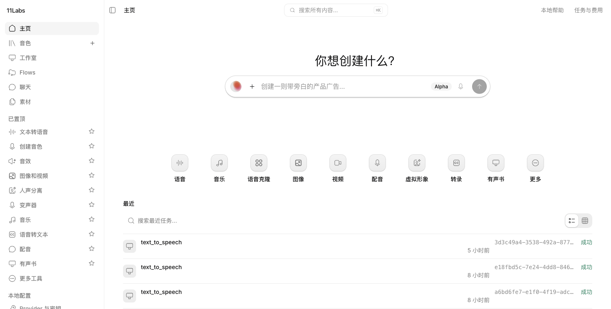 | 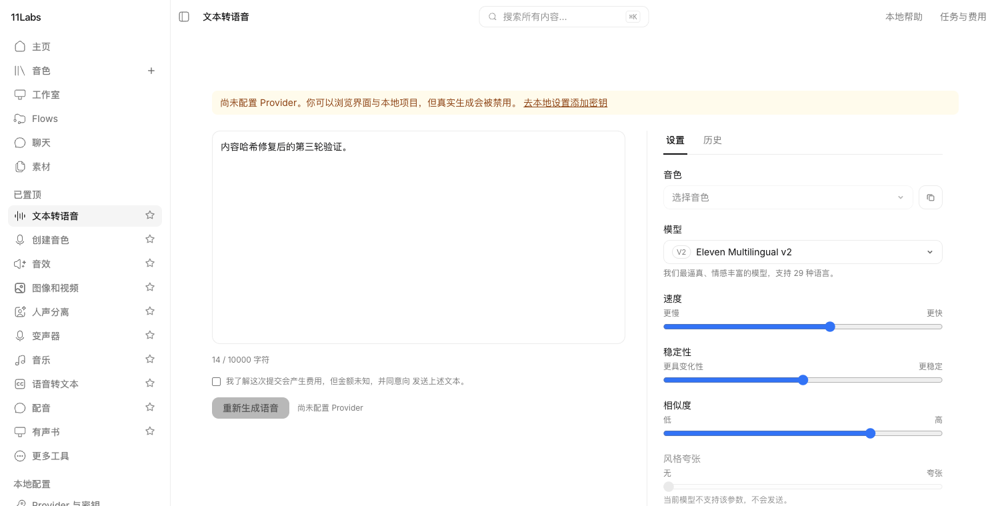 |
| 主页:提示框 / 灵感工具行 / 最近项目 | 文本转语音:双栏轨 / 模型与音色弹层 / 历史 |
| 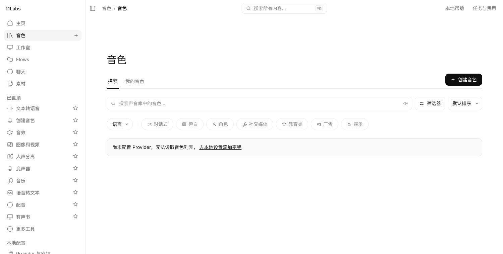 | 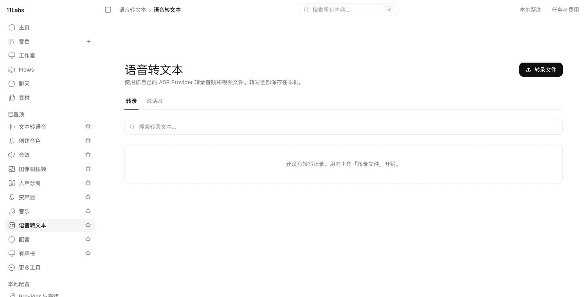 |
| 音色库:探索 / 筛选 / 分类 | 语音转文本:转录库与「转录文件」四源弹层 |
| 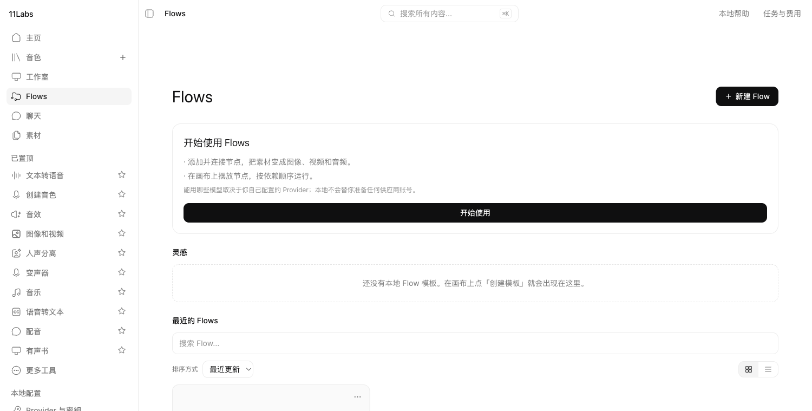 | 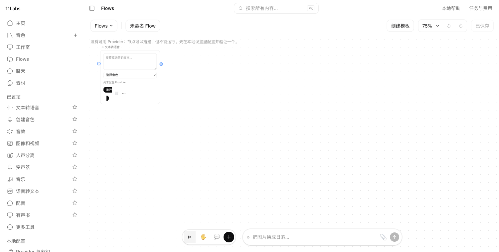 |
| Flows 列表 | 画布:节点 / 连线 / 添加节点菜单 / 保存态 |
| 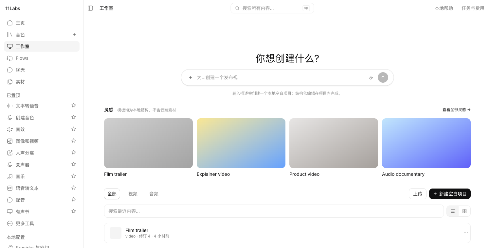 | 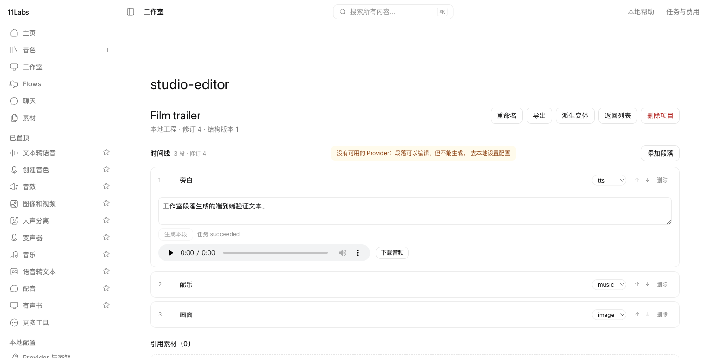 |
| 工作室:灵感模板 / 项目列表 | 编辑器:段落时间线 / 逐段生成与试听 |
| 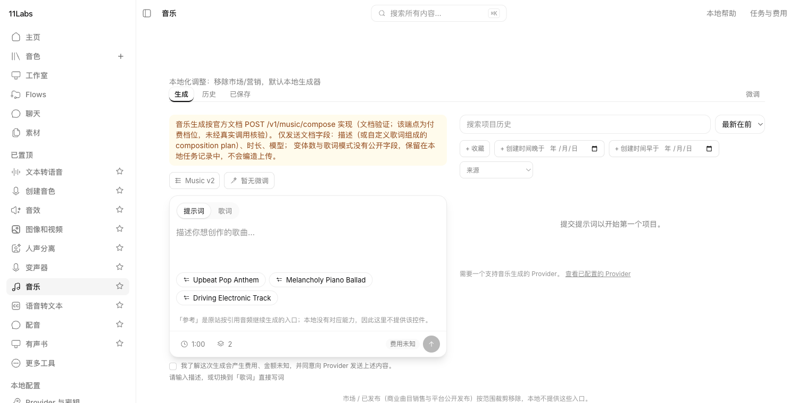 | 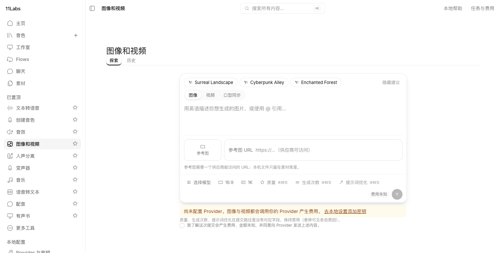 |
| 音乐:两栏 composer(文档化接入) | 图像 / 视频 / 口型同步 |
| 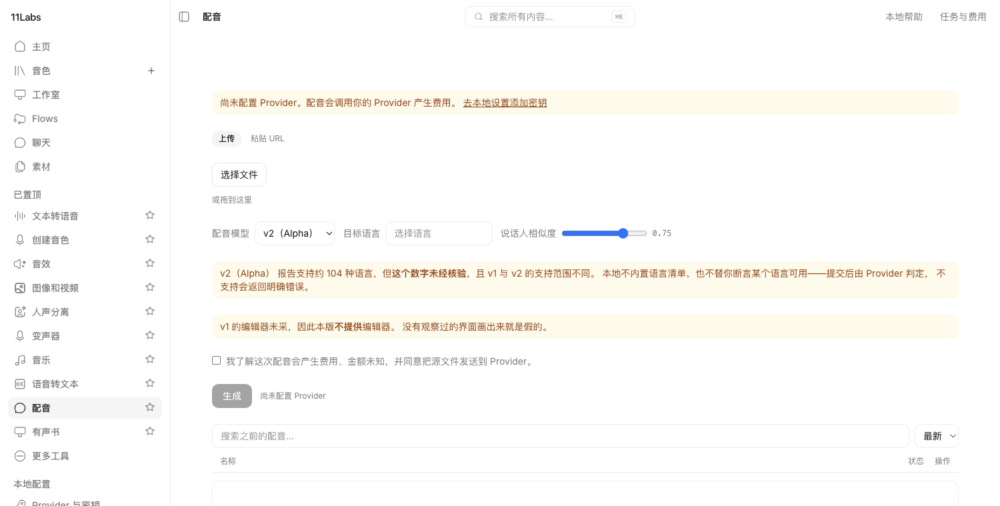 | 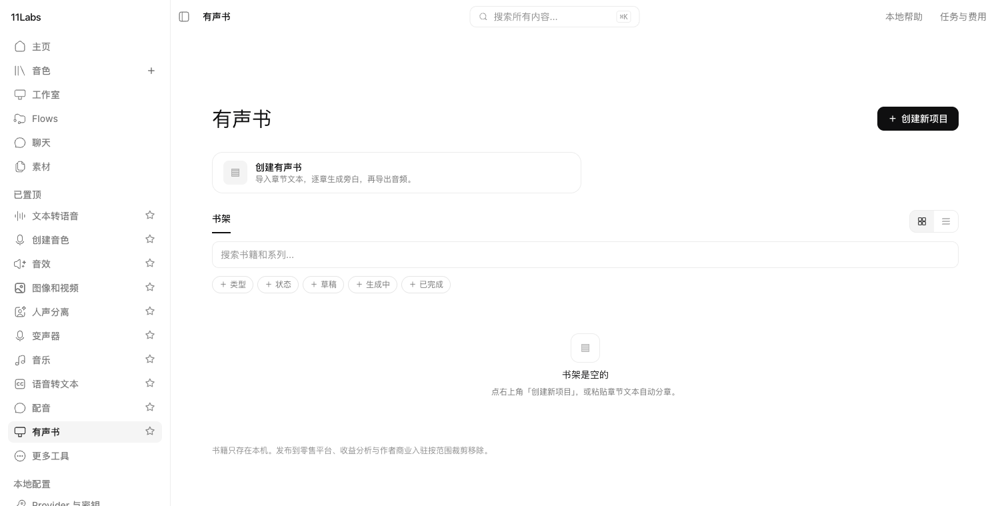 |
| 配音:上传 / URL / 模型 / 相似度 | 有声书:书架 / 分章生成 |
| 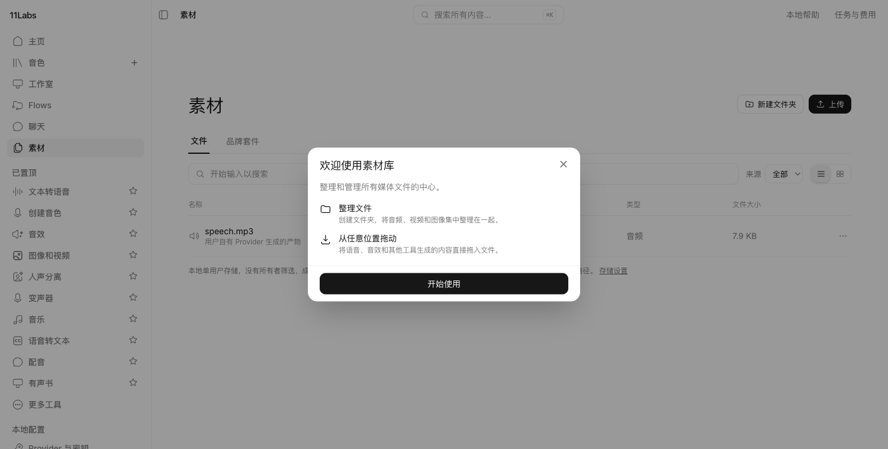 | 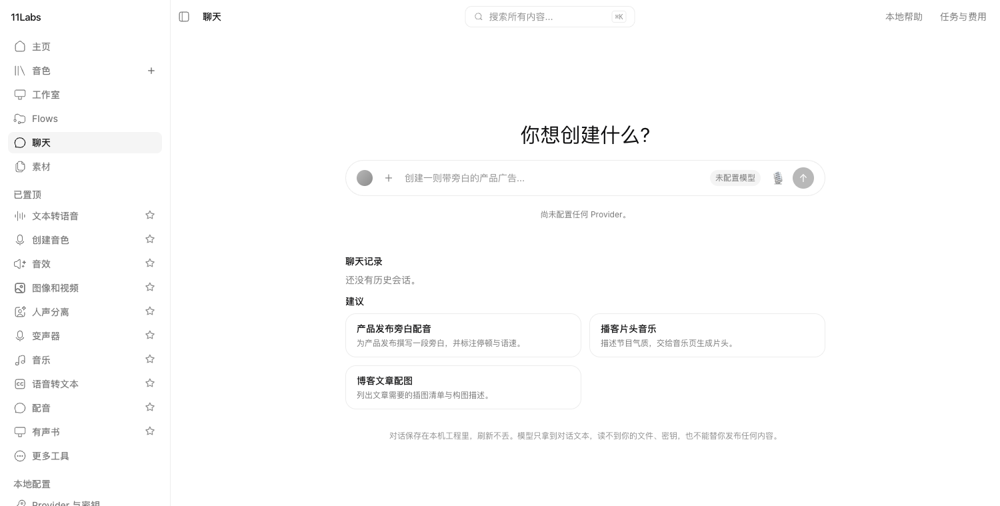 |
| 素材:列表 / 网格 / 文件夹 | 聊天(BYOK LLM) |
| 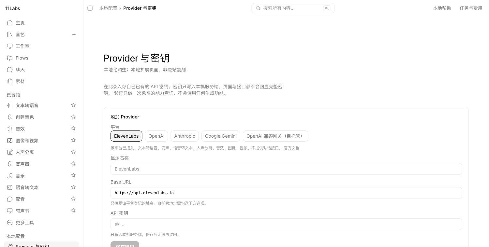 | |
| 本地扩展:Provider 与密钥(write-only 金库) | |

---

## 运行

### 依赖

Node **≥ 22**(本机实测 v26.7.0 使用 `node:sqlite`)。npm ≥ 10。

### 开发(两进程)

```bash
npm install

# 终端 1:本地 BYOK 服务端(loopback only)
node server/cli.mjs --port 5174 --data ./data

# 终端 2:前端
npm run dev          # http://localhost:5173
```

> **必须显式指定 `--port 5174`**:Vite 开发代理默认把 `/api` 转发到
> `http://127.0.0.1:5174`,而 `server/cli.mjs` 不带参数时默认监听 **5173**。
> 想换端口就设 `EL_API_TARGET=http://127.0.0.1:<port>` 启动 Vite。
> **只跑 `npm run dev` 会得到一个所有 API 调用都失败的界面。**

### 生产(单进程同源)

```bash
npm start            # = npm run build && node server/cli.mjs
```

静态产物与 API 同源,默认 <http://127.0.0.1:5173>。服务端**只绑定回环地址**,
没有 `--host` 开关——把密钥金库暴露到局域网是本版本明确不做的事。

### 校验

```bash
npm run typecheck    # tsc -b --noEmit
npm test             # vitest run(当前 445 用例 / 31 文件全绿,退出码 0)
npm run build
```

---

## 架构

```
浏览器 ──同源──> 本地服务端(loopback)
                   ├── vault.mjs      write-only 密钥金库(save-only,永不回显)
                   ├── jobs.mjs       持久任务队列(intentId 去重、崩溃安全状态机)
                   ├── cost.mjs       成本账本(未知就写 unknown,不写 0)
                   ├── assets.mjs     内容寻址素材库(从字节嗅探容器,不信客户端 MIME)
                   ├── media.mjs      纯代码媒体分析(零 Provider 可用)
                   ├── safe-fetch.mjs SSRF 防护(逐跳复验、私网/link-local 拒绝)
                   └── ytdlp.mjs      yt-dlp 音频提取(数组传参,shell:false)
                         │
                         └──> 用户自己的 Provider(ElevenLabs / OpenAI 兼容 / 自托管)
```

密钥只在派发瞬间从金库解析,**绝不写入任务快照**。生产静态资源与 API 同源;
Host/Origin/CSRF/会话校验不因为是 localhost 而省略。

### 能力三态与费用

能力一律标 `available` / `unavailable` / `unverified`。**未观察到的能力不得当作支持,
未知的费用不得显示为 0。** 每个 Provider 适配器都返回带 `reason` 的能力项,
成本以 `character-cost` 计量但不换算金额,除非有可核验的价格。

### 生成能力现状

- **自托管/OpenAI 兼容 TTS**:端到端实测可用(注册→验证→生成→试听→下载→刷新恢复;
  `tests/qa/local-tts-e2e.test.mjs`)。
- **音乐生成**:按官方文档 `POST /v1/music/compose` 接入(仅发文档字段;
  `tests/qa/music-generation.test.mjs`)。
- **托管供应商全部能力**:保持 `unverified`——无测试密钥,未做过真实调用。
- **口型同步**:公开 API 无对应端点(已核验文档索引),本地明确拒绝并说明原因。

---

## 目录结构

```
src/            前端(Vite + React 19 + TS + Tailwind v4)
  app/          壳 / 路由 / 面包屑
  components/   侧栏 / 顶栏 / 工具网格 / 提示框 / 全局搜索
  features/     voice / media / editors / storage / core(BYOK 设置)
server/         本地服务端(loopback,同源 API + 静态托管)
packages/       providers/(elevenlabs / openai 兼容 / anthropic / google + registry)
                contracts/(任务 / 能力 / 成本 / 错误契约)
specs/          范围裁剪 / 页面规范 / 路由清单 / 控件登记表
tests/          contract / integration / unit / qa(445 用例)
docs/           工程文档 / 交接 / 验收证据 / screenshots(本 README 截图)
scripts/        visual-audit(本地截图巡检)
```

---

## 美术资源来源

| 资源 | 来源 | 许可 |
|---|---|---|
| 图标几何 `src/lib/icons.tsx` | 从参考站渲染 UI 追踪 | **再分发状态未确认(D3,阻塞正式发布)** |
| 字体 `public/fonts/Outfit-*.woff2` | Google Fonts Outfit | SIL OFL 1.1,见 `OFL-Outfit.txt` |

原站专有的 **Waldenburg 字体已删除**,替换为度量相近的 OFL Outfit,
字形偏差登记在 [`public/fonts/README.md`](public/fonts/README.md)。
公开仓库不得携带不可再分发的专有字体。

图标由 `tools/build-icons.mjs` 从 bundle 提取几何后生成,`src/lib/icons.tsx` 是生成文件:

```bash
node tools/fetch-bundles.mjs   # 下载图标库 bundle(已 gitignore,不入库)
node tools/build-icons.mjs     # 重新生成 src/lib/icons.tsx
```

---

## 已知边界(尚未还原 / 未验证)

- **托管供应商真实链路未验证**:项目发起者未提供测试密钥与预算授权,
  托管能力矩阵保持全 `unverified`;首条托管真实端到端链路没有实测证据。
- **逐控件视觉精确验收未完成**:`research/` 下的截图语料含账号标识,保持私有、
  不随仓库分发;像素级比对需在受控环境内另行执行(方法与首轮数据见
  `docs/qa/visual-pass-1.md`)。
- **图标授权未清**:见上表与 `docs/DECISIONS.md` D3。
- m4a/ogg/flac 的时长解析**未实现**,返回 `null` 并说明未做猜测;压缩格式不做波形。

---

## 许可

自有代码 [MIT](LICENSE)。第三方资产按各自条款单列,**不并入 MIT**。
本项目与 ElevenLabs 无隶属或背书关系。
